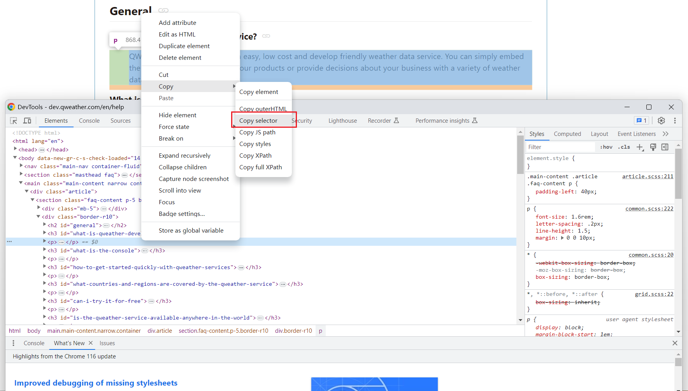

# 分工
正常聊天+流式传输+网络搜索    朱旭
网页总结+语音输入+语音输出    覃诗睿
图片生成+图片分类            张泽卿
文件聊天+函数调用            刘张毅

# 打造你的AI助手

本次大作业的任务是打造专属于你的AI助手。我们会首先在自己的电脑上配置运行语言模型，文生图模型，文转音模型，音转文模型，利用这些模型提供的能力，我们接着实现一个可以交互的AI助手，他能够跟我们聊天，能够生成图片，能够听懂发给他的语音，也能够通过语音进行回答，能够总结文件内容，还能进行图像分类。具体来说，我们会首先使用[LocalAI](https://localai.io/basics/getting_started/)在本机上配置运行各个模型，LocalAI会为我们提供各个模型能力的[API](https://localai.io/features/)，我们会用到[语言生成API](https://localai.io/features/text-generation/)，[图片生成API](https://localai.io/features/image-generation/)，[语音转文字API](https://localai.io/features/audio-to-text/)，[文字转语音API](https://localai.io/features/text-to-audio/)，[函数调用API](https://localai.io/features/text-to-audio/)。我们会将这些API接入AI助手，其中交互界面我们使用[gradio](https://www.gradio.app/)实现，类似下图。我们可以在文本框里输入文字，回车发送文字，AI助手会进行回复。我们也可以输入特定指令，如"/image A cute baby sea otter"，让AI助手为我们生成一张可爱的海獭宝宝图片。我们也可以上传文件，让AI助手根据文件内容回答我们的问题。我们也可以点击Clear的按钮清空聊天记录。下面我们会介绍如何运行起AI助手以及我们需要完成的功能。


## 配置环境

请先clone初始仓库

git已经完成了，以下部分仍然需要。

接着安装docker desktop https://www.docker.com/products/docker-desktop/

下载模型文件https://cloud.tsinghua.edu.cn/f/3a1d99f369614d63a4f2/?dl=1解压至`LocalAI/models`文件夹，目录结构如下：

```
models
├── completion.tmpl
├── en-us-blizzard_lessac-medium.onnx
├── en-us-blizzard_lessac-medium.onnx.json
├── ggml-gpt4all-j
├── ggml-openllama.bin
├── gpt-3.5-turbo.yaml
├── gpt4all.tmpl
├── openllama-instruct-chat.yaml
├── openllama-instruct-completion.yaml
├── openllama.yaml
├── stablediffusion_assets
│   ├── AutoencoderKL-256-256-fp16-opt.param
│   ├── AutoencoderKL-fp16.bin
│   ├── FrozenCLIPEmbedder-fp16.bin
│   ├── FrozenCLIPEmbedder-fp16.param
│   ├── log_sigmas.bin
│   ├── tmp-AutoencoderKL-encoder-256-256-fp16.param
│   ├── UNetModel-256-256-MHA-fp16-opt.param
│   ├── UNetModel-MHA-fp16.bin
│   └── vocab.txt
├── stablediffusion.yaml
├── tmp-AutoencoderKL-encoder-256-256-fp16.param
├── whisper-en.bin
└── whisper.yaml
```

运行各个模型【同学们不需要具体了解每个模型的结构，我们这里直接使用即可】

```bash
cd LocalAI
docker compose up -d --pull always
```

检测是否运行正常，**LocalAI暴露的接口地址为http://localhost:8080**

```bash
curl http://localhost:8080/models
```

输出应为，**注意下面列表中的id即为之后调用API的模型名，即model字段**，其中**模型`gpt-3.5-turbo`用于实现聊天回复，`openllama`用于实现函数调用，`stablediffusion`用于实现生成图片，`whisper-1`用于实现语音转文字，`en-us-blizzard_lessac-medium.onnx`用于实现文字转语音**。

```javascript
{"object":"list","data":[{"id":"gpt-3.5-turbo","object":"model"},{"id":"openllama","object":"model"},{"id":"stablediffusion","object":"model"},{"id":"whisper-1","object":"model"},{"id":"en-us-blizzard_lessac-medium.onnx","object":"model"},{"id":"tmp-AutoencoderKL-encoder-256-256-fp16.param","object":"model"}]}
```

检测是否能正常调用API(这里可能无法正常输出)

```bash
curl http://localhost:8080/v1/chat/completions -H "Content-Type: application/json" -d '{
     "model": "gpt-3.5-turbo",
     "messages": [{"role": "user", "content": "Say this is a test!"}],
     "temperature": 0.7
   }'
```

输出类似于

```javascript
{"object":"chat.completion","model":"gpt-3.5-turbo","choices":[{"index":0,"finish_reason":"stop","message":{"role":"assistant","content":"\n I'm sorry, but that's not a valid response. Can you please provide more information or clarify your request?"}}],"usage":{"prompt_tokens":0,"completion_tokens":0,"total_tokens":0}}
```

接着我们运行AI助手界面

```bash
# 回到ai-assistant目录
cd ..
pip install -r requirements.txt
python app.py
# 访问http://127.0.0.1:7861/
```

浏览器界面如下图，现在我们输入，AI助手会默认回复That’s cool


助教同时提供了部署好的接口地址：http://166.111.80.169:8080/，部署遇到困难的同学可以使用，但建议本地部署。


## 基本介绍

我们与AI助手正常聊天时，AI助手需要有记忆上下文的能力，即我们在调用语言模型时需要传递给语言模型我们的聊天记录，这里我们调用时使用的聊天记录格式为：

```bash
[{"role": "user", "content": "Who won the world series in 2020?"},
{"role": "assistant", "content": "The Los Angeles Dodgers won the World Series in 2020."},
{"role": "user", "content": "Where was it played?"}]
```

其中每项包含`role`和`content`字段，`role`字段有两种，一种为`user`，代表我们说的话，另一种为`assistant`，代表AI助手的回复，`content`字段代表聊天内容。此外，**聊天记录中user和assistant严格交替出现，且user第一个出现**。当我们调用语言模型进行回复时，可以通过`messages`字段传递聊天记录，这样AI助手可以根据上下文进行回复，如：

```bash
curl http://localhost:8080/v1/chat/completions -H "Content-Type: application/json" -d '{
     "model": "gpt-3.5-turbo",
     "messages": [{"role": "user", "content": "Who won the world series in 2020?"},
				{"role": "assistant", "content": "The Los Angeles Dodgers won the World Series in 2020."},
				{"role": "user", "content": "Where was it played?"}],
     "temperature": 0.7
   }'
```

语言模型接收的聊天记录为`app.py`中的`messages`变量，**即我们需要在聊天过程中维护该变量，记录正确格式的聊天记录**。此外，我们在实现交互界面时也需要记录所有的聊天内容用于展示，**需要注意的是交互界面中的聊天记录格式与上面传递给语言模型的聊天记录格式不相同**，交互界面中的聊天记录记为`app.py`中的`history`变量，其格式为：

```python
[(user, assistant), (user, assistant), (user, assistant)]
```

即每个元组里第一项为我们的说话内容，第二项为AI助手的说话内容。此外，这种格式也支持展示文件，如

```
[((mnist.png, ), assistant)]
```

即在元组里再使用元组，其中内容为文件路径，即可在交互界面中展示对应的文件。


## 功能实现

接下来我们需要开始逐点实现功能，总分数按百分计，最后会根据大作业占比进行换算。在9月15日的课程汇报中，根据现场演示及代码检查进行评测。15日晚12点前需要在网络学堂上提交代码压缩包，提交代码格式为：

```
[学号]_[姓名拼音]_hw5
- app.py
- chat.py
- fetch.py
- function.py
- image_generate.py
- mnist.py
- pdf.py
- search.py
- stt.py
- tts.py
```

即创建一个名称为 `[学号]_[姓名拼音]_hw5` 的文件夹，将整个文件夹打包成 `.zip` 压缩包后，上传到网络学堂。注意不需要提交【图片分类】功能中LeNet的模型权重文件。


### 正常聊天【10分】

现在AI助手会默认回复That‘s cool，这对我们实际聊天时没有帮助，我们现在需要调用我们之前配置好的`gpt-3.5-turbo`来帮助AI助手进行回复，具体来说通过文本框发送内容后，**我们需要收集完整的聊天记录，并以正确的格式通过API传递给语言模型，AI助手使用语言模型的输出进行回复**。样例如下：


实现：
- 请实现`chat.py`中的`chat`函数，其参数为`app.py`中的`messages`变量，其返回值为语言模型的输出【5分】
- 请在`app.py`中正确记录`messages`变量，`history`变量，并正确调用`chat.py`中的`chat`函数，接着更新`messages`变量和`history`变量【5分】

提示：可以使用API接口进行实现，也可以使用openai的sdk进行实现。API接口实现请参考https://localai.io/features/text-generation/#chat-completions，sdk实现请参考https://localai.io/basics/getting_started/#python，https://platform.openai.com/docs/guides/gpt/chat-completions-api。建议使用sdk进行实现，更为方便。


### 流式传输【10分】

在实现正常聊天功能时，我们可能会发现模型输出很慢，我们需要等很久才能收到AI助手的回复，如果模型能边输出，AI助手边回复，我们就可以更快看到结果，减少我们的等待时间。流式传输即可以完成这样的功能，即边输出边回复。样例如下，**可以注意到AI助手并不是等待很长时间，一次回复全部文字，而是更快开始回复，边输出边回复**


实现：
- 请修改`chat.py`中的`chat`函数，其参数为`app.py`中的`messages`变量，其返回值为流式传输格式的`generator`【5分】
- 请在`app.py`中正确调用`chat.py`中的`chat`函数，实现流式更新`history`变量，并在接收完毕后更新`messages`变量【5分】

提示：流失传输实现请参考https://www.gradio.app/guides/creating-a-custom-chatbot-with-blocks#add-streaming-to-your-chatbot，https://platform.openai.com/docs/api-reference/chat/create#stream，https://github.com/openai/openai-cookbook/blob/main/examples/How_to_stream_completions.ipynb


### 网络搜索【5分】

语言模型由于受训练数据限制，并不能及时获取最新的信息以解答我们的问题。这种情况下，我们可以先通过搜索引擎进行搜索，将搜索到的内容以及我们的问题同时传递给语言模型，让语言模型能够基于最新的内容以回复我们。具体为，我们通过"/search Who is Sun Wukong?"指令触发AI助手的搜索机制，**注意指令格式均为`/command content`**，`/command`会触发AI助手对`content`做特殊的处理。处理`/search content`指令时，我们首先需要使用SerpApi的[必应搜索接口](https://serpapi.com/bing-search-api)，使用`content`作为查询进行搜索，得到搜索结果后，我们使用**第一条的搜索结果（organic_results字段）的`snippet`字段**，作为`search results`。得到搜索结果后，我们将用户的内容以正确的询问方式替换为`content`+`search results`，即**需要更新`messages`格式如**

```javascript
[{"role": "user", "content": "Who won the world series in 2020?"},
{"role": "assistant", "content": "The Los Angeles Dodgers won the World Series in 2020."},
{"role": "user", "content": content+search results}]
```
**注意我们不需要替换交互界面聊天记录即history的内容**，交互界面正常显示`/search content`即可。**注意这里`content`+`search results`并不是代表简单拼接**，我们需要使用`content`和`search results`组合成有效的提问，以`/search Who is Sun Wukong? `为例，以下为一个`messages`实例，**我们可以自己设计如何组合以获得更好的回复**。

```python
[{"role": "user", "content": "Who won the world series in 2020?"},
{"role": "assistant", "content": "The Los Angeles Dodgers won the World Series in 2020."},
{"role": "user", "content": f"Please answer {content} based on the search result: \n\n{search results}"}]
```

样例如下：


实现：

- 请修改`search.py`中的`search`函数，其参数为`content`，使用SerpApi的[必应搜索接口](https://serpapi.com/bing-search-api)对`content`进行搜索，返回值为处理好的`content`+`search results`，**注意我们需要申请SerpApi的API KEY。**【3分】
- 请在`app.py`中添加网络搜索功能，在接收到`/search content`指令时，正确调用`search.py`里的`search`函数，得到处理好的`content`+`search results`后，将更新后的`messages`传递给语言模型，并使AI助手回复获取到的内容。【2分】


### 网页总结【5分】

与网络搜索类似，有时候我们想使用AI助手自动帮我们阅读一个网页，并总结归纳出网页里得具体内容。`/fetch url`指令用户触发AI助手实现这样的功能，其中**`url`严格为一个网页链接**，我们不需要检查网页链接格式是否有效。对`/fetch url`进行处理时，我们首先需要拉取`url`对应的网页链接内容得到`fetch results`，接着我们对网页链接内容进行处理，得到有效的提问`question`，再接着**更新`messages`**，并将其传递给语言模型，使AI助手回复语言模型输出的内容，`messages`格式如

```javascript
[{"role": "user", "content": "Who won the world series in 2020?"},
{"role": "assistant", "content": "The Los Angeles Dodgers won the World Series in 2020."},
{"role": "user", "content": question}]
```

**注意我们不需要替换交互界面聊天记录即history的内容**，交互界面正常显示`/fetch content`即可。**在由`fetch results`得到`question`的过程中，我们需要对`fetch results`做适当处理以形成易于理解的question**。处理过程分为两步：

- `fetch results`为一个包含`HTML`格式的文档，我们需要提取出有效的文字信息，这里为简化操作，**我们只需要考虑如何从https://dev.qweather.com/en/help网页中提取出如下p标签里面的文字信息**，即我们只需要考虑`url`为https://dev.qweather.com/en/help，在接收到`/fetch https://dev.qweather.com/en/help`指令后，得到HTML文档`fetch results`后，提取出如下的文字信息`processed results`，这里`processd results`即为QWeather Develop Service is an easy, low cost and develop friendly weather data service. You can simply embed the needed weather data into your products or provide decisions about your business with a variety of weather data.

  

- 在得到`processed results`后，我们对`processed results`进行修改，使其形成一个有效的提问，如得到如下的`question`：

  ```python
  f"Act as a summarizer. Please summarize {url}. The following is the content: \n\n{processed results}"
  ```

  我们可以设计更好的提问方式。

样例如下：


实现：

- 请实现`fetch.py`中的`fetch`函数，其参数为`url`，**url严格为https://dev.qweather.com/en/help**，在处理过程中请先拉取网页链接内容，接着提取上方说明里的p标签里面的文字信息，最后得到处理好的`question`进行返回。【3分】
- 请在`app.py`中添加网页总结功能，在接收到`/fetch url`指令时，正确调用`fetch.py`里的`fetch`函数，得到处理好的`question`后，将更新后的`messages`传递给语言模型，并使AI助手回复获取到的内容。【2分】

提示：

- 可以使用BeautifulSoup结合CSS选择器抽取元素，https://www.crummy.com/software/BeautifulSoup/bs4/doc.zh/#id42

- CSS选择器可以使用浏览器开发者工具中的`Copy selector`获取

  


### 图片生成【10分】

除了单纯的文字输出外，我们也希望AI助手能为我们生成有意思的图片。`/image content`用于实现这样的功能，其中`content`用于描述我们想生成出什么样的图片，AI助手在接收到这样的指令后，会调用stablediffusion的API接口生成图片，并进行回复。注意`messages`变量这里不用特殊处理，因为我们不会调用语言模型。**但是，我们需要更新messages变量以记录完整的聊天记录**，如：（其中后两行是我们需要更新的）

```
[{"role": "user", "content": "Who won the world series in 2020?"},
{"role": "assistant", "content": "The Los Angeles Dodgers won the World Series in 2020."},
{"role": "user", "content": '/image A cute baby sea otter'}]
{"role": "assistant", "content": 'http://localhost:8080/generated-images/b642806052444.png'}]
```

**注意我们不需要替换交互界面聊天记录即history的内容**，交互界面正常显示`/image content`即可。**但是需要处理以使得AI助手能显示图片**（显示图片请参考基本介绍章节）

样例如下：


实现：

- 请实现`image_generate.py`中的`image_generate`函数，其参数为`content`，调用https://localai.io/features/image-generation/#usage的API接口生成图片，并返回生成的图片地址。【5分】
- 请在`app.py`中添加图片生成功能，在接收到`/image content`指令时，正确调用`image_generate.py`里的`image_generate`函数，得到生成的图片地址后，使AI助手进行回复。【5分】

提示：调用https://localai.io/features/image-generation/#usage的API接口时，其`prompt`参数即为`content`，其`size`参数请默认设置为"256x256"，实现过程中也可以使用sdk，请参考https://platform.openai.com/docs/api-reference/images/create


### 语音输入【10分】

除了我们使用文字与AI助手进行交流外，我们也希望AI助手能直接听懂我们说的话。上传文件按钮用于实现这样的功能。具体的，我们在点击上传文件按钮后，判断文件`file`是否是`wav`格式（**判断时直接判断文件名是否以wav结尾即可**），如果是wav格式文件，则我们需要调用[语音转文字接口](https://localai.io/features/audio-to-text/#usage)，获取音频文件对应的文字内容`content`，在得到`content`文件内容后，我们更新`messages`，并将其传递到语言模型，使AI助手回复获取到的内容，`messages`格式如下：

```javascript
[{"role": "user", "content": "Who won the world series in 2020?"},
{"role": "assistant", "content": "The Los Angeles Dodgers won the World Series in 2020."},
{"role": "user", "content": content}]
```

**注意我们不需要替换交互界面聊天记录即history的内容**，交互界面正常显示音频文件即可。（显示音频文件请参考基本介绍章节）。样例如下【上传sun-wukong.wav】：


实现：

- 请实现`stt.py`中的`audio2text`函数，其参数为`file`，调用https://localai.io/features/audio-to-text/#usage的API得到文字内容，并进行返回。【5分】
- 请在`app.py`中添加语音输入功能，在接收到音频文件时，正确调用`stt.py`里的`audio2text`函数，更新`messages`后，使AI助手进行回复。【5分】


### 语音输出【10分】

除了AI助手使用文字或者图片回复我们外，我们也希望AI助手能够使用语音回复我们。`/audio content`用于实现这样的功能。具体的，我们在输入`/audio content`后，AI助手会使用语言模型得到输出，并将其输出通过[文字转语音接口](https://localai.io/features/text-to-audio/)生成音频，AI助手进而使用音频进行回复。**注意`messages`变量中仍然记录文字内容的回复，`history`变量需要进行修改以支持显示音频文件。**`messages`变量格式如下：

```javascript
[{"role": "user", "content": "Who won the world series in 2020?"},
{"role": "assistant", "content": "The Los Angeles Dodgers won the World Series in 2020."},
{"role": "user", "content": "/audio Who are you?"}]
{"role": "assistant", "content": "I am an AI language model"}]
```

样例如下：


实现：

- 请实现`tts.py`中的`text2audio`函数，其参数为`content`，调用https://localai.io/features/text-to-audio/的API得到音频文件后，保存并返回文件路径。【5分】
- 请在`app.py`中添加语音输出功能，在接收到`/audio content`时，更新`messages`后，调用语言模型得到输出，并正确调用`tts.py`里的`text2audio`函数，使AI助手回复音频，**注意实现时等待语言模型输出完毕后，再生成音频文件即可，不用支持音频文件的流式输出**。【5分】


### 文件聊天【10分】

有时候，我们希望AI助手能根据某个材料回复我们的问题。上传文件用于实现这样的功能。具体的，在上传文件后，我们需要判断文件名是否以`txt`结尾，如果是`txt`结尾，则我们处理记录当前已上传的文字材料内容`current_file_text`，并进行处理得到对其进行归纳总结的提问`summary_prompt`，调用[文字补全接口](https://localai.io/features/text-generation/#completions)得到回复，使AI助手返回总结的内容。接着，我们输入`/file content`指令，AI助手会使用`current_file_text`内容结合`content`内容，组合为有效的提问`question`，并使用[文字补全接口](https://localai.io/features/text-generation/#completions)进行回复。**注意文字补全接口不用传递上下文，只用传递组合好的`question`即可（prompt参数），但是`messages`变量中仍然需要记录聊天记录。**归纳总结及组合`question`，我们可以根据网页总结以及网络搜索章节中类似的方法进行处理。`messages`格式如下：

```javascript
[{"role": "user", "content": summary_prompt},
{"role": "assistant", "content": "Hello"}, # 调用文字补全接口时只需传递prompt=summary_prompt
{"role": "user", "content": question}]
{"role": "assistant", "content": "Hello"}] # 调用文字补全接口时只需传递prompt=question
```

样例如下【上传sample.txt】：


实现：

- 请实现`pdf.py`中的`generate_text`函数，其参数为`summary_prompt`或者`question`，调用文字补全接口并返回内容。【2分】
- 请实现`pdf.py`中的`generate_summary`函数，其参数为`current_file_text`，进行处理得到对其进行归纳总结的提问`summary_prompt`，并返回。【2分】
- 请实现`pdf.py`中的`generate_question`函数，其参数为`current_file_text`和`content`，进行处理得到对其进行归纳总结的提问`question`，并返回。【2分】
- 请在`app.py`中添加文件聊天功能，在接收到txt文件时，调用`pdf.py`中的`generate_summary`函数，更新`messages`，调用`pdf.py`中的`generate_text`函数得到输出，使AI助手进行回复；在接收到`/file content`时，更新`messages`，调用`pdf.py`中的`generate_text`函数得到输出，使AI助手回复。【2分】
- 请支持`pdf.py`中的`generate_text`函数的流式输出。【2分】

提示：文字补全接口可以调用https://localai.io/features/text-generation/#completions，也可以使用sdk，请参考https://platform.openai.com/docs/api-reference/completions/create，调用参数除`model`及`prompt`外不限制。


### 函数调用【15分】

AI助手由于受训练数据限制，并不是万能的。比如我们如果想获取今天的天气，AI助手并不能知道。这时我们可以使用函数调用来实现类似的功能。函数调用是指在我们调用语音模型时可以同时给其传递我们希望调用的函数信息，使其按照我们期望的函数调用的参数格式进行返回，如我们询问"What's the weather like in Beijing?"，同时我们传递函数`get_current_weather`的信息，`get_current_weather`期望接收参数为一个地址字符串，那么AI助手可以给我们回复该字符串参数，我们接着根据这个参数调用我们自己实现的`get_current_weather`函数获取Beijing的天气信息。具体的，**我们使用`openllama`模型来实现该功能**。这里我们需要支持两种函数调用，一个是获取某个地方的天气信息，另一个是实现记录TODO的功能。函数调用通过`/function content`触发，并使用[函数调用接口](https://localai.io/features/openai-functions/#usage-example)传递`messages`及`functions`，让AI助手回复选择调用的`function`，在调用该`function`后，AI助手使用其输出进行回复。**注意`messages`使用调用`function`的输出更新聊天记录的回复即可，更新聊天记录的问题时需要删除`/function `，只保留`content`**。

功能说明：需要支持获取天气信息，如`/function What's the weather like in Beijing?`，记录TODO功能：如`/function Add a todo: walk`。回复天气信息时需要使用函数调用抽取出地理位置`location`，接着使用[城市搜索API](https://dev.qweather.com/docs/api/geoapi/city-lookup/)得到地理位置的ID`location_id`【返回第一个地理位置的ID即可】，再使用[实时天气API](https://dev.qweather.com/docs/api/weather/weather-now/)查询该地理位置的温度（feelsLike字段），文字描述（text字段），湿度（humidity字段），按f"Temperature: {feelsLike} Description: {text} Humidity: {humidity}"的格式返回。回复记录TODO时，如`/function Add a todo: walk`，**注意只需要考虑`/function Add a todo: {something}`**这种形式，需要在服务端持久化记录当前已有的TODO列表，同时使用函数调用抽取出TODO项`todo`，将TODO项加入TODO列表中，并返回如下格式的输出：

```markdown
- walk
- swim
```

样例如下：


实现：

- 请实现`function.py`中的`lookup_location_id`函数，其参数为`location`，调用[城市搜索API](https://dev.qweather.com/docs/api/geoapi/city-lookup/)，返回`location_id`。【2分】
- 请实现`function.py`中的`get_current_weather`函数，其参数为`location`，调用`lookup_location_id`得到`location_id`后，调用[实时天气API](https://dev.qweather.com/docs/api/weather/weather-now/)按功能说明里面的格式返回。【2分】
- 请实现`function.py`中的`add_todo`函数，其参数为`todo`，记录TODO项后，按功能说明里面的格式返回已有的所有TODO项。【2分】
- 请实现`function.py`中的`function_calling`函数，其参数为更新后的`messages`，使用函数调用得到要调用的函数名及参数后，调用对应的函数，并返回其输出。【7分】
- 请在`app.py`中添加函数调用功能，在接收到`/function content`时，更新`messages`后，调用`function.py`中的`function_calling`函数，使AI助手回复。【2分】

提示：函数调用请参考https://localai.io/features/openai-functions/，https://openai.com/blog/function-calling-and-other-api-updates，注意这里由于需要支持两个功能，因此需要传递两个函数。**此外，由于函数调用输出可能不准，因此建议测试两个功能时分开单独测试，类似样例。注意需要申请QWeather的API_KEY。**


### 图片分类【15分】

同样的，我们也希望AI助手能支持图片分类功能。在第三次小作业中，我们已经实现了LeNet针对mnist的图片分类，下面我们将其集成在AI助手中。具体的，在上传文件`file`后，我们需要判断文件名`filename`是否以`png`结尾，如果是`png`结尾，则**我们需要调用我们在第三次作业中得到的训练好的LeNet图片分类模型**，对其进行分类，并使AI助手输出分类结果，格式为`Classification result: {result}`。**注意`messages`也需要更新，用户内容更新为`Please classify {filename}`，AI助手内容更新为上述返回结果**。此外，`history`变量中需要支持在交互界面中显示上传的图片。样例如下：


实现：

- 请实现`mnist.py`中的`image_classification`函数，其参数为`file`，调用我们在第三次作业中训练得到的LeNet图片分类模型，返回上述格式的分类结果。【10分】
- 请在`app.py`中添加图片分类功能，在接收到图片时（文件名以`png`结尾），更新`messages`后，调用`mnist.py`中的`image_classification`函数，使AI助手回复。【5分】


